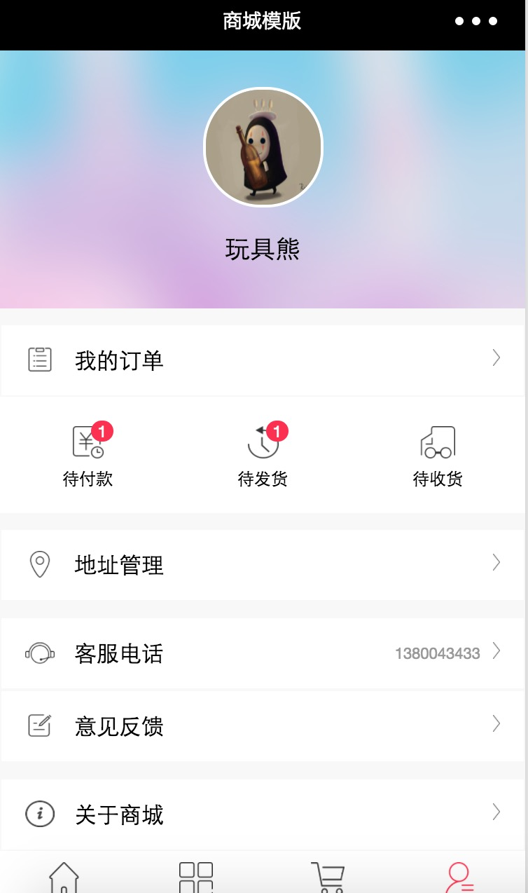

# WechatApp
For the micro-code small program some of their own code accumulated

对微信小程序的一些研究，关于电商部分。

##效果图

###首页

###购物车

###用户中心

###订单列表

###商品详情

##开发

###[微信小程序文档](https://mp.weixin.qq.com/debug/wxadoc/dev/index.html)

###概述

简单的电商系统小程序开发实践

- /lib/request.js       请求封装方法js
- /lib/resource.js      请求资源封装js
- /lib/promise__        引入promise
- /lib/city             引入城市选择控件
- /templates            小程序模版目录
- /wxParse              小程序html解析扩展

###使用

克隆本项目 -> 在微信开发工具中添加项目 -> 选择项目app目录

### 展示的数据为纯静态数据，只为熟悉组件和基本用法。

### [微信小程序支付开发文章](https://segmentfault.com/a/1190000007737052)
