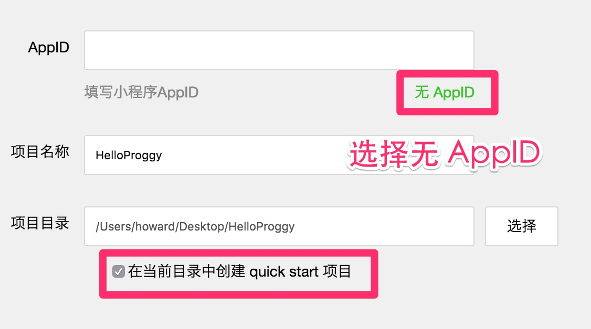

# 直播地址：live.bilibili.com/1330246

+ 360 网盘

https://yunpan.cn/ckpeWFHURJfeu （提取码：0800）

# 直播前的准备

直播前可以先把安装工具准备好，直播时才方便跟着一起做。

1. 阅读[简易开发指南](https://mp.weixin.qq.com/debug/wxadoc/dev/?t=1474974355400), 只需要 15 分钟
2. 下载[开发者工具](https://mp.weixin.qq.com/debug/wxadoc/dev/devtools/devtools.html?t=1474974350348)
3. 创建一个新的模板项目，运行起来

没有开发者账号的话选择 “无 AppID”



# 直播时跟着做

先克隆仓库到本地:

```
git clone git@git.oschina.net:hayeah/wxapp-Breakfast.git
```

然后用开发者工具打开这个示范项目

# 设计稿


[下载设计文件](design.sketch)

# 讨论群

加老师机微信好友，带你入群。今晚 8 点发车！


开始直播后老师机没法拉你，请找副驾驶拉群：

+ mrwiredancer
+ kaixin_fighting


